# Weekly Schedule Card

[](https://github.com/hacs/integration)


<a href="https://www.buymeacoffee.com/arozoire" target="_blank">
  
</a>

A visual weekly schedule card for Home Assistant — drag-and-drop time slots,
color-coded profiles, multi-entity groups, conditions and notifications,
all on top of the [Scheduler Component](https://github.com/nielsfaber/scheduler-component).

<p align="center">
  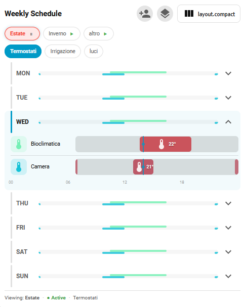
</p>

---

## Highlights

- **Two cards from one codebase** — full editor + read-only dashboard view
- **Two editing layouts**: `columns` and `rows`
- **Profiles** with one-click activation and automatic exclusivity rules
- **Entity groups** with shared color and bulk management
- **Auto-off / auto-on** via a generated HA automation (`wsc_autooff_*`)
- **Conditions** that compile to a generated HA automation (since the
  Scheduler Component does not support `conditions` natively)
- **Manual override** — change a conditional schedule's entity by hand and it
  stops re-applying until the next slot (safety direction still fires)
- **Notifications** when a schedule fires — server-side HA automation, works
  even with every dashboard closed (with smart default message)
- **Climate, light, fan, cover, valve, switch, lock, input_boolean, humidifier,
  water_heater** domains with per-domain popup controls
- **One-shot schedules** — mark a schedule "use and discard" and it deletes
  itself after the last selected day runs
- **Keyboard accessible**: interactive controls are reachable by Tab and
  activate with Enter/Space (`role`/`tabindex`, `aria-pressed`/`aria-expanded`,
  `:focus-visible`)
- **i18n**: English, Italian, French, Spanish, Portuguese, German, Dutch,
  Polish, Swedish, Norwegian, Danish, Czech (auto-detect from HA locale)

---

## The cards

This repository ships **five** Lovelace custom elements built from the same
source: the two main cards below — `weekly-schedule-card` (editing) and
`weekly-schedule-view-card` (read-only) — plus three bonuses, the
`weekly-schedule-mini-card` (active-now summary), the `quick-timer-card`
(temporary timer) and the `weekly-serpentine-card` (decorative weekly
overview). All five are inlined in the main bundle.

### `weekly-schedule-card` — editing

The full-featured card for creating and managing schedules.

- 2 layouts: `columns` (7-column grid) and `rows` (per-day timelines);
  toggle with the header button
- Click an empty cell → create-schedule popup
- Click a block → edit-schedule popup
- Drag to resize time slots, snap configurable via `time_step`
- Profile creation / rename / duplicate / delete / exclusive activation
- Group entities (shared color, entity picker)
- Inline conditions and notifications per schedule

<table>
  <tr>
    <td align="center">
      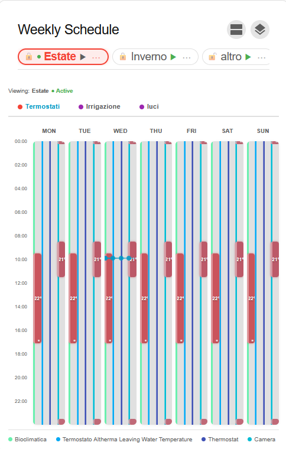<br>
      <sub><b>Columns (7-column grid)</b></sub>
    </td>
    <td align="center">
      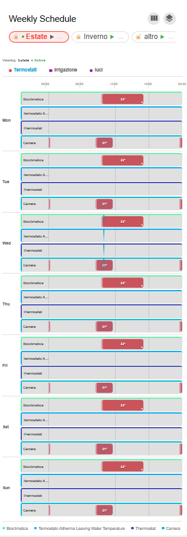<br>
      <sub><b>Rows (per-day timelines)</b></sub>
    </td>
  </tr>
</table>

<p align="center">
  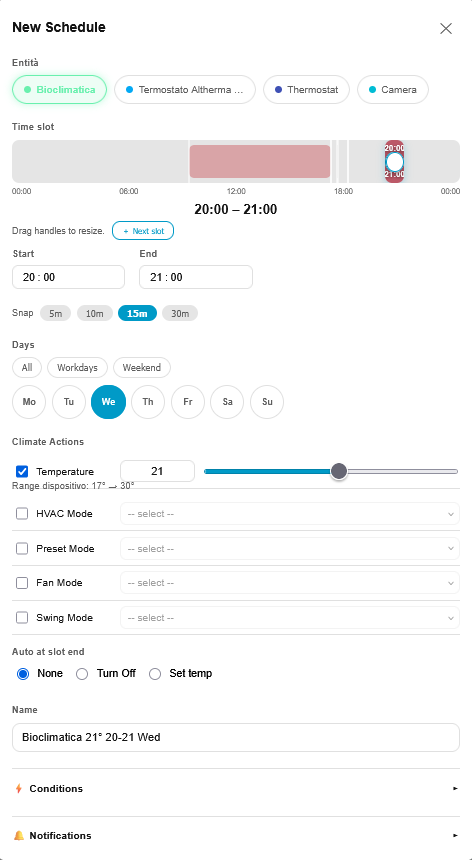<br>
  <sub><b>Create / edit schedule popup</b></sub>
</p>

### `weekly-schedule-view-card` — visualization

Read-only by default, optimized for dashboards and wall displays.

- 2 layouts: `focus` (default) and `compact`
- Toggle layout with the header button (toggles `focus ↔ compact`)
- Read profile chips with one-click activate / deactivate
- Click a block → opens **the same edit popup** as the editing card
- Hover for tooltip with schedule details
- Live "time-now" line
- No profile creation, no group management

<table>
  <tr>
    <td align="center">
      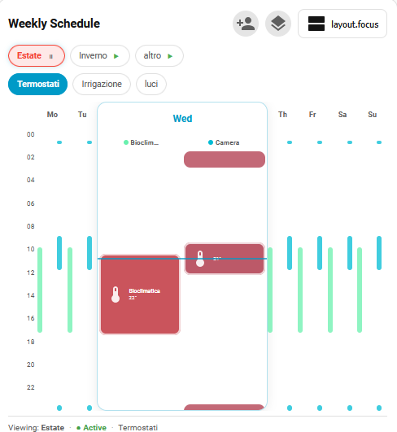<br>
      <sub><b>Focus (one day expanded)</b></sub>
    </td>
    <td align="center">
      <br>
      <sub><b>Compact (collapsible days)</b></sub>
    </td>
  </tr>
</table>

### `weekly-schedule-mini-card` — currently active

A compact status card bundled with the editing card. Shows what's running
right now, grouped by parent entity, with live attribute values.

<p align="center">
  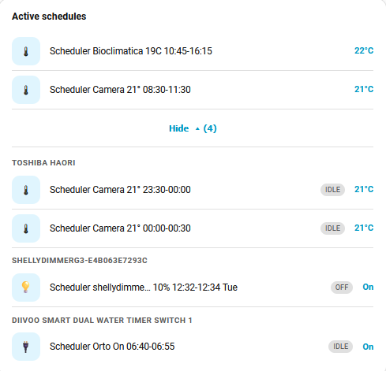
</p>

### `quick-timer-card` — temporary timer

A single-entity card (bundled into the main bundle since **v1.2.2**; also shipped
as its own `dist/quick-timer-card.js` for timer-only installs): the **standard HA
entity card** (native `tile`, embedded via `loadCardHelpers`) for direct control,
plus a **Timer** panel. Pick a value and
a **duration _or_ end time** → it applies the value, then restores the entity to its
**previous state** when the timer ends. Examples: thermostat 21 °C for 45 min,
lights red for 5 min, irrigation on for 10 min.

<p align="center">
  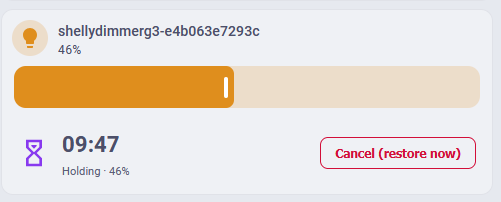<br>
  <sub><b>Holding a value with a live countdown and one-tap restore</b></sub>
</p>

- **No scenes left behind** — the restore is computed at start and baked into a
  *transient* automation (`automation.qt_timer_*`) that is auto-removed ~30 s after
  the timer ends (or immediately on cancel). Nothing lingers at rest.
- **Overlap with schedules → most recent wins**: start a timer over an active
  schedule and the timer wins; if a schedule slot begins while the timer runs, the
  schedule wins and the timer skips its restore.
- **Cancel = restore now.** Active timers are stored in **shared** state, so the
  countdown/cancel show on every device.

Configure it from the **visual card editor** (entity, name, default duration, preset
chips, language) — or in YAML. The advanced embedded-card override (`card:`) stays YAML-only:

```yaml
type: custom:quick-timer-card
entity: climate.bedroom
name: Bedroom            # optional
presets: [5, 10, 15, 30, 45, 60]   # optional minute chips
```

> Included in the main bundle (since v1.2.2) — no extra resource needed. A
> standalone `/local/quick-timer-card.js` resource is also available for
> timer-only installs (see below).

### `weekly-serpentine-card` — decorative weekly overview

A **decorative weekly overview** (new in **v1.3.0**): the whole week rendered as one
continuous ribbon that folds back on itself row after row — a true
[boustrophedon](https://en.wikipedia.org/wiki/Boustrophedon): Monday flows left→right,
Tuesday right→left, Wednesday left→right, and so on, each row joined to the next by a
rounded U-turn. Midnight sits at the apex of each curve — there are no hour ticks or
midnight markers, the shape tells the story.

<p align="center">
  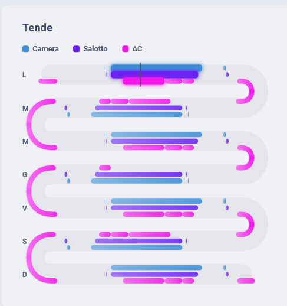<br>
  <sub><b>Three entities (Camera, Salotto, AC) as concentric sub-lanes folding through each U-turn</b></sub>
</p>

- **Multi-entity**: pick any entities in `entities:`; each gets its own color and a
  swatch in the legend, rendered as a parallel sub-lane inside the ribbon. Up to 3 is the
  sweet spot for readability — past that a soft, dismissible-by-config-change warning
  appears, but there's **no hard limit**. Sub-lanes **alternate order every row** (v1.3.4)
  so that through each U-turn they stay **concentric** and never cross.
- **Midnight flows through the curve** (v1.3.3): a slot that touches the start or end of a
  day bends along the U-turn to its apex instead of stopping flat at the edge, so a block
  ending at 24:00 and one starting at 00:00 read as a single continuous stream around the bend.
- **Thin "now" indicator**: a small perpendicular tick + dot on today's row, no glow or label.
- Schedule pills are colored by entity; the one active **right now** is brighter with a
  soft glow. Disabled schedules are dimmed.
- **Click a pill → the same edit-schedule popup** used by the editing/view cards (days,
  time slot, per-domain actions, conditions, notifications, linked objects). No drag-on-ribbon
  (curves + reversed rows + midnight wraparound would fight the drag UX and the clean look) —
  resize/move a slot from the popup's own controls instead.

```yaml
type: custom:weekly-serpentine-card
title: "Zona giorno"        # optional
language: "it"              # optional, auto-detect like the other cards
entities:                   # accepts plain strings or {entity, name, color}
  - climate.camera
  - light.salotto
  - switch.caldaia
```

> Included in the main bundle — no extra resource needed. Also ships as its own
> `dist/weekly-serpentine-card.js` bundle if you only want this card.

---

## Installation

### Via HACS (recommended)

1. Add this repository as a **Custom Repository** in HACS → Frontend.
2. Install. HACS deploys and registers the main bundle automatically.
3. Since **v1.2.2** the main bundle bundles **all five** custom elements
   (`weekly-schedule-card`, `weekly-schedule-view-card`,
   `weekly-schedule-mini-card`, `quick-timer-card`, `weekly-serpentine-card`),
   so the single resource HACS registers exposes every card — no extra
   Lovelace resource needed. Just hard-refresh after install.

### Manual

Copy the bundles from `dist/` into your HA config:

```
dist/weekly-schedule-card.js       →  /config/www/weekly-schedule-card.js
dist/weekly-schedule-view-card.js  →  /config/www/weekly-schedule-view-card.js
dist/quick-timer-card.js           →  /config/www/quick-timer-card.js         (only if you use it)
dist/weekly-serpentine-card.js     →  /config/www/weekly-serpentine-card.js   (only if you use it)
```

### Register resources

For **HACS installs** the main bundle already registers all five cards — you
don't need to add anything. For **manual `/config/www/` installs**, register at
least the main bundle in **Settings → Dashboards → Resources** (or your
`lovelace.yaml`):

```yaml
resources:
  - url: /local/weekly-schedule-card.js
    type: module
```

The main bundle inlines the view, mini and quick-timer cards, so this single
resource is enough. If you prefer the lighter **standalone view bundle**
(read-only, no editor code), register it instead/in addition:

```yaml
  - url: /local/weekly-schedule-view-card.js
    type: module
```

The **`quick-timer-card`** is included in the main bundle. If you want only
the quick-timer card (without the full schedule editor), it also ships as a
**standalone bundle** — register it as a separate resource:

```yaml
  - url: /local/quick-timer-card.js
    type: module
```

The **`weekly-serpentine-card`** is included in the main bundle too, and also
ships standalone for decorative-only installs:

```yaml
  - url: /local/weekly-serpentine-card.js
    type: module
```

For `/hacsfiles/...` paths, replace `/local/` with
`/hacsfiles/weekly-schedule-card/`.

Hard-refresh the browser (Ctrl/Cmd + Shift + R) after registering.

---

## Configuration

Both cards share the same YAML schema; the view card silently ignores
editing-only fields.

```yaml
type: custom:weekly-schedule-card        # or weekly-schedule-view-card
title: "Weekly Schedule"                 # optional
language: it                             # optional, auto-detected from HA
time_step: 15                            # optional, minutes snap
entities:                                # also configurable from the UI
  - entity: climate.bedroom
    name: "Bedroom"
    color: "#F44336"
  - entity: switch.irrigation
    name: "Garden"
    color: "#4CAF50"
temperature:
  min: 5
  max: 80
  slider_max: 35
notifications:
  service: notify.mobile_app_phone
```

### Options

| Field                  | Type            | Default       | Notes |
|------------------------|-----------------|---------------|-------|
| `title`                | string          | _(none)_      | Header title |
| `language`             | `en` `it` `fr` `es` `pt` `de` `nl` `pl` `sv` `no` `da` `cs` | auto | Falls back to HA locale, then browser |
| `time_step`            | integer (min)   | `15`          | Snap interval for drag |
| `entities[]`           | list            | `[]`          | Can also be edited from the card UI |
| `entities[].entity`    | entity_id       | _required_    | Climate / light / switch |
| `entities[].name`      | string          | entity name   | Override label |
| `entities[].color`     | hex             | from palette  | Block color |
| `temperature.min`      | number          | `5`           | Slider lower bound (°C) |
| `temperature.max`      | number          | `80`          | Manual input upper bound (°C) |
| `temperature.slider_max` | number        | `35`          | Slider upper bound (°C) |
| `notifications.service`| service id      | _(none)_      | Pre-fills notify service in the popup |

---

## Data model — what lives where

This is the most common source of confusion. The card YAML is **presentation
only**. Schedules themselves are not in the YAML — they are first-class HA
entities owned by the [Scheduler Component](https://github.com/nielsfaber/scheduler-component).

| Layer | Owner | Storage | What it holds |
|-------|-------|---------|---------------|
| Presentation | this card | Lovelace YAML | Which entities to render, colors, layout, language, popup defaults |
| Schedules | Scheduler Component | `switch.schedule_*` entities | `weekdays`, `timeslots`, `entities`, `actions`, `current_slot` |
| Profiles & groups | this card | **Shared** `input_text` helpers (`input_text.wsc_store_*`) — global, same for every HA user | One JSON blob `{ groups, profiles[], activeProfiles[] }` (each profile holds its `groups`, `schedules`, `scheduleLinks`), compressed and split into ≤255-char chunks |
| Conditions | this card | `automation.wsc_*` (generated) | One HA automation per conditional schedule, lifecycle-bound to it |
| Auto-off / auto-on | this card | `automation.wsc_autooff_*` (generated) | One HA automation per schedule, fires the end-of-slot action when `current_slot` clears |
| One-shot | this card | `automation.wsc_oneshot_*` (generated) | One HA automation per "use and discard" schedule, calls `scheduler.remove` after the last selected day runs |

**Implication for users**: deleting a `switch.schedule_*` entity from HA
removes the schedule globally — the card just reflects HA state.
Conversely, schedules created from anywhere (UI, service call, another
integration) appear in the card automatically as long as their target
`entity_id` is in the card's `entities` list.

---

## Where schedules live (and how to create one without the UI)

Schedules are stored as `switch.schedule_*` entities by the Scheduler
Component. The card calls `hass.callService('scheduler', 'add'|'edit'|'remove', ...)`
under the hood — you can call the same services yourself from
**Developer Tools → Services**, scripts, or automations.

### Create a schedule

```yaml
service: scheduler.add
data:
  entity_id: climate.bedroom
  weekdays: [mon, tue, wed, thu, fri]
  timeslots:
    - start: "08:00:00"
      stop: "22:00:00"
      actions:
        - service: climate.set_temperature
          entity_id: climate.bedroom
          service_data:
            temperature: 21
```

### Edit a schedule

```yaml
service: scheduler.edit
data:
  entity_id: switch.schedule_abc123     # existing schedule
  weekdays: [sat, sun]
  timeslots: [...]                       # new slots replace old ones
```

### Remove a schedule

```yaml
service: scheduler.remove
data:
  entity_id: switch.schedule_abc123
```

### Fields the Scheduler Component does NOT accept

These belong inside `timeslots[]` but **will be rejected** if you try to
include them — this card works around the limitation:

| Missing feature | Workaround built into this card |
|-----------------|---------------------------------|
| `conditions` per slot | Generates an HA automation (`automation.wsc_*`) that gates the schedule's actions |
| `stop_action` per slot | Generates an HA automation (`automation.wsc_autooff_*`) that runs the end-of-slot action |

See [Conditions & Notifications](#conditions--notifications) and
[Auto-off / Auto-on](#auto-off--auto-on) for the full mechanism.

---

## Domain support

| Domain | Popup controls | Action service |
|--------|----------------|----------------|
| `climate` | temperature slider (5–80 °C, manual input up to 100 °C), `hvac_mode`, `preset_mode`, `fan_mode`, `swing_mode` (optional) | `climate.set_temperature` (+ mode services if set) |
| `light`   | on/off + optional `brightness` slider + optional **RGB color** | `light.turn_on` (`brightness_pct` / `rgb_color`) / `light.turn_off` |
| `fan`     | on/off + optional **speed %** | `fan.turn_on` (`percentage`) / `fan.turn_off` |
| `cover`   | **open / close / stop / set position** (mutually exclusive). The position slider is directional — dragging **right closes more** (0 % = closed, 100 % = open) | `cover.open_cover` / `close_cover` / `stop_cover` / `set_cover_position` |
| `valve`   | **open / close / stop / set position** — same controls as `cover` | `valve.open_valve` / `close_valve` / `stop_valve` / `set_valve_position` |
| `switch`  | on/off toggle | `switch.turn_on` / `switch.turn_off` |
| `lock`    | lock / unlock | `lock.lock` / `lock.unlock` |
| `input_boolean` | on/off toggle | `input_boolean.turn_on` / `turn_off` |
| `humidifier` | on/off + optional target **humidity %** + optional **mode** | `humidifier.turn_on` (`set_humidity` / `set_mode`) / `turn_off` |
| `water_heater` | target **temperature** + optional **operation mode** | `water_heater.set_temperature` / `set_operation_mode` |
| _other_   | recognized as `unknown`; basic on/off only | `homeassistant.turn_on` / `turn_off` |

The popup adapts at render time via `_detectDomain(entity_id)`. The
toggle in the popup also calls `switch.turn_on/off` immediately for
preview, and saves the final action set via `scheduler.edit`.

### Examples by domain

**Climate** (heating 18 °C on weekdays, 21 °C on weekends):

```yaml
service: scheduler.add
data:
  entity_id: climate.bedroom
  weekdays: [mon, tue, wed, thu, fri]
  timeslots:
    - start: "07:00:00"
      stop: "23:00:00"
      actions:
        - service: climate.set_temperature
          entity_id: climate.bedroom
          service_data: { temperature: 18 }
```

**Light** (evening dim):

```yaml
service: scheduler.add
data:
  entity_id: light.living_room
  weekdays: [mon, tue, wed, thu, fri, sat, sun]
  timeslots:
    - start: "20:00:00"
      stop: "23:30:00"
      actions:
        - service: light.turn_on
          entity_id: light.living_room
          service_data: { brightness_pct: 40 }
```

**Switch** (irrigation 06:00–06:15):

```yaml
service: scheduler.add
data:
  entity_id: switch.irrigation
  weekdays: [mon, wed, fri]
  timeslots:
    - start: "06:00:00"
      stop: "06:15:00"
      actions:
        - service: switch.turn_on
          entity_id: switch.irrigation
```

---

## Quick start

Smallest possible setup (after installing the resources):

```yaml
type: custom:weekly-schedule-card
title: Test schedule
entities:
  - entity: switch.test_switch
    name: Test
    color: "#03A9F4"
```

Same entities, view-only:

```yaml
type: custom:weekly-schedule-view-card
title: Test schedule view
entities:
  - entity: switch.test_switch
    name: Test
    color: "#03A9F4"
```

### Smoke-test checklist

EN:

- [ ] Editing card renders the 7-column grid
- [ ] Click on an empty cell opens the create-schedule popup
- [ ] Create a schedule (days + slots) → colored block appears
- [ ] Click on the block opens the edit popup
- [ ] View card shows the same schedule in `focus` layout
- [ ] Layout toggle on the view card toggles `focus ↔ compact`
- [ ] Hover on a block → tooltip
- [ ] Empty click on the view card → create popup (shared with editing card)

IT:

- [ ] La editing card mostra la griglia 7 colonne
- [ ] Click su una cella vuota apre il popup di creazione schedule
- [ ] Crea uno schedule (giorni + slot orario) → appare un blocco colorato
- [ ] Click sul blocco apre il popup di modifica
- [ ] View card mostra la stessa schedule in vista `focus`
- [ ] Toggle vista nella view card alterna `focus ↔ compact`
- [ ] Hover su blocco → tooltip
- [ ] Click vuoto nella view card → popup di creazione (stesso della editing card)

---

## Profiles & Groups

**Profiles** are named bundles of schedules — think "Summer", "Winter",
"Holiday". Activating a profile enables its schedules; deactivating disables
them. Profiles that share at least one entity become **mutually exclusive**:
activating one auto-deactivates the conflicting ones, so you cannot end up
with two competing setpoints on the same climate.

Profiles are persisted in **shared `input_text` helpers** so every HA user (and
device) sees the same profiles, groups and schedules. The JSON blob is compressed
and split across `input_text.wsc_store_0..N` (+ `input_text.wsc_store_meta`), which
the card **creates automatically** the first time an admin saves; existing per-user
data is **migrated once, automatically**. Saves are **batched into one write per
user action**, and the card refetches when another device writes (live cross-device
sync). Notes: creating/deleting those helpers requires an **admin** user (regular
users can still view, and edit without growing the data); the helpers appear under
**Settings → Devices & Services → Helpers**.

**Groups** bundle entities together inside a profile. They share a color and
appear as a single chip in the toolbar. Useful for "all thermostats" or
"all irrigation valves".

<p align="center">
  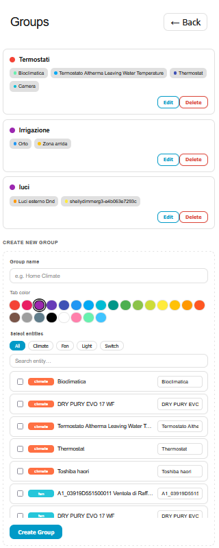<br>
  <sub><b>Group management &amp; creation</b></sub>
</p>

Both profiles and groups are managed from the **editing card only** —
the view card lets users *activate* profiles but not create or rename them.

---

## Conditions & Notifications

### Conditions

The Scheduler Component does **not** support `conditions` on timeslots, so
this card emits a dedicated HA automation per conditional schedule. The
automation is created / updated / deleted in lockstep with the schedule.

Mechanism (**event-driven** — no polling):

- **Trigger**: slot start/end (the schedule's `current_slot` attribute) **plus**
  every state *and* attribute change of the condition entities — so the
  automation only runs when something actually changes, never on a timer.
- **Condition**: `current_slot != null` on the parent schedule switch +
  user-defined conditions (operator + value)
- **Action**: the schedule's **active** actions when the conditions pass, the
  **stop** actions (turn off / set back) when they fail

The schedule switch itself stays enabled — only the downstream actions are
gated. The popup UI adapts to the selected condition entity (numeric slider
for sensors, dropdown for selects, etc.), and the entity field has a custom
**autocomplete** (filters by entity id and friendly name) that works on
desktop **and** mobile / the HA companion app.

#### Hysteresis (deadband)

Numeric conditions support a **deadband** to avoid rapid on/off flapping around
the threshold. Leave the **± tolerance** field empty for the default (**5 % of
the value**), type a number for an absolute band, or `0` for a hard threshold.
The generated template is *stateful*: the effective threshold shifts depending
on whether the active action is already applied (e.g. a `< 60` condition with a
band of 3 turns on below 57 and back off above 63).

<p align="center">
  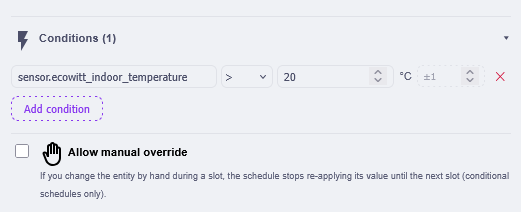<br>
  <sub><b>A numeric condition with its ± deadband and the manual-override toggle</b></sub>
</p>

#### Manual override (conditional schedules)

Enable **Allow manual override** (checkbox in the conditions section) and a
conditional schedule will **stop fighting you**: if you change the target
entity by hand during a slot — from the device itself or from HA — the
schedule stops re-applying its value until the **next slot**, then resumes
automatically.

- The **safety direction still fires**: if the condition turns *false* (e.g.
  humidity rises back above threshold) the stop action runs anyway.
- It only re-applies after a *genuine* condition change, not after your manual
  action — so it never clobbers what you set by hand.
- State is held by a tiny trigger-less marker automation
  (`automation.wsc_ovrflag_*`); the **Linked objects** panel shows whether an
  override is active and offers a **Cancel override** button (resumes
  immediately if conditions are met).
- A Home Assistant **restart clears the override** (the Scheduler re-applies
  the active slot on boot).

Plain schedules (no conditions) get this behavior **for free** — the Scheduler
Component already keeps manual mid-slot changes until the next timeslot.

### Notifications

Optionally fire a notification when a schedule's slot starts or ends. The
message defaults to a pre-filled summary (entity, time window, target
state) which you can customize per schedule.

Notifications are emitted by a **generated HA automation** (`automation.wsc_notify_*`),
triggered on the schedule's `current_slot` attribute with a `choose` for the
start/end transition. Because it runs server-side, it fires **24/7 even when
every dashboard is closed** — there is no longer a "tab must be open"
limitation.

### Auto-off / Auto-on

When a schedule needs an explicit end-of-slot action (turn off, set back to a
fallback temperature, close a cover, …), this card generates a **dedicated HA
automation** (`automation.wsc_autooff_*`):

- **Trigger**: the schedule's `current_slot` attribute clears (slot ended)
- **Guard**: a short delay + a template check that skips the action if another
  WSC schedule has already taken over the same entity (avoids fighting the
  next slot)
- **Action**: the per-domain end action you configured — `turn_off`,
  `set_temperature`, `set_hvac/preset/fan/swing_mode`, `set_brightness`,
  `set_color`, `set_speed`, `set_position` / open / close / stop, etc.

The automation is created / updated / deleted in lockstep with the schedule.

> 🔧 The **Linked objects** panel at the bottom of the edit popup lists every
> generated object (auto-off, condition, notify, one-shot automations) with a
> live status badge and **Open** / **Edit YAML** shortcuts.

<p align="center">
  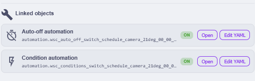<br>
  <sub><b>The Linked objects panel: every generated automation with its status and quick actions</b></sub>
</p>

### One-shot schedules (use and discard)

Tick **Use and discard** (checkbox under the day picker) to make a schedule
**delete itself** after it has run once. The semantics: it runs on the **next
occurrence of every selected day**, then removes itself after the last one — e.g.
set on a Wednesday for Mon/Tue/Fri, it fires next Fri, Mon and Tue, then calls
`scheduler.remove`.

- The expiry (the furthest of the upcoming end-of-slot occurrences) is computed
  once at save time and stored as a local wall-clock timestamp.
- A dedicated automation (`automation.wsc_oneshot_*`) triggers on slot end and
  removes the schedule once the expiry passes — event-driven, like auto-off.
- A safety net at card load (`_cleanupExpiredOneShots`) garbage-collects any
  one-shot that already expired while HA was off.

---

## Troubleshooting

| Symptom | Likely cause / fix |
|---------|--------------------|
| Card not rendering / `custom element doesn't exist` | Main bundle resource registered? Hard refresh (Ctrl/Cmd+Shift+R)? |
| No schedules visible | Install [Scheduler Component](https://github.com/nielsfaber/scheduler-component) (required) |
| Popup doesn't open on view card | Check console — `_openEditPopup` must be inherited from the editing bundle |
| Conditions don't trigger | Check the generated `automation.wsc_*` — it must be enabled |
| Notifications never fire | Check the generated `automation.wsc_notify_*` is enabled and the notify service exists |

---

## Development

```bash
npm install
npm run build      # one-shot bundle into dist/
npm run watch      # watch mode
npm run deploy     # build + copy dist/*.js to /config/www/
```

The four bundles are built by Rollup as self-contained IIFEs that inline
`src/base-card.js`. Do **not** copy `src/*.js` directly to HA — the
sources use ES module `import`s that the browser will not resolve without
the bundler. Always deploy from `dist/`.

Source layout:

```
src/
  base-card.js                   # shared class + inline LOCALES (en/it/fr) + storage
  weekly-schedule-card.js        # editing card (extends base); imports view/quick-timer/serpentine + mini card
  weekly-schedule-view-card.js   # view-only card (extends base)
  quick-timer-card.js            # single-entity temporary-timer card (extends base) + its editor
  weekly-serpentine-card.js      # decorative boustrophedon weekly overview (extends base)
  lz-string.js                   # vendored compression for shared storage (MIT)
rollup.config.js                 # four IIFE entries (minified with terser)
scripts/deploy.js                # cross-platform deploy (dist/*.js → /config/www)
dist/
  weekly-schedule-card.js        # bundled editing card (+ view + mini + quick-timer + serpentine)
  weekly-schedule-view-card.js   # bundled view card
  quick-timer-card.js            # bundled standalone quick-timer card
  weekly-serpentine-card.js      # bundled standalone serpentine card
```

---

## Credits

This project stands on the shoulders of [@nielsfaber](https://github.com/nielsfaber)'s
excellent work, and is heavily **inspired by it**:

- **Backend (required)** — all schedules are stored and executed by the
  [Scheduler Component](https://github.com/nielsfaber/scheduler-component)
  (GPL-3.0), which you install separately. This card is only a frontend for it.
- **Inspiration** — the official [Scheduler Card](https://github.com/nielsfaber/scheduler-card)
  inspired this project. Weekly Schedule Card is an **independent
  re-implementation** (hand-written vanilla JS, MIT) with a different focus —
  a visual weekly-grid view, profiles, groups and color-coding. It does **not**
  reuse any source code from the Scheduler Component or Scheduler Card; it only
  talks to the backend through its public Home Assistant services.
- UI conventions and CSS variables follow Home Assistant's design tokens.

Huge thanks to nielsfaber for building and maintaining the Scheduler Component
that makes all of this possible. 🙏

## License

MIT
